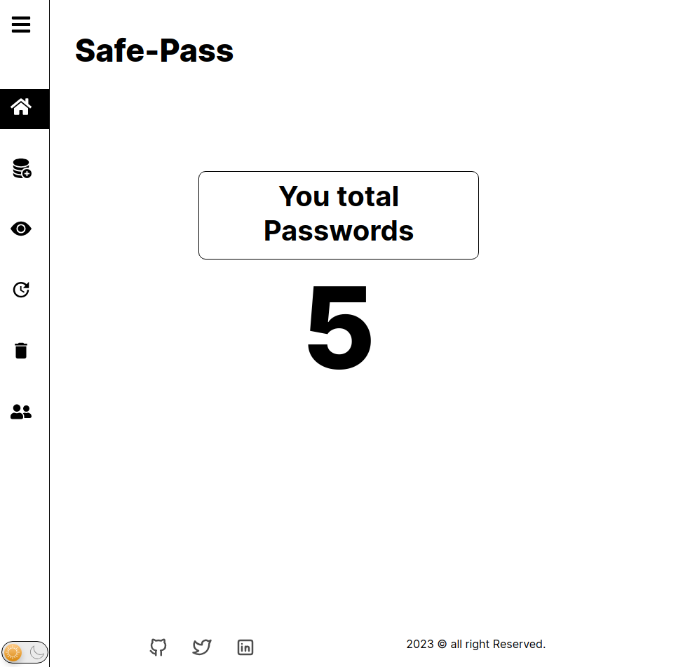

# Safepass

it's an app that manages your password, and store them in an sql db. I built it using `nodejs` and `express` in the backend and `React` for the front-end. This README provides an overview of the app's features and functionalities.

## Features

- **Store passwords**: you can store your password by providing website, email, password.
- **Update password**: you can update stored passwords
- **Remove password**: you can also remove stored passwords
- **Show passwords**: you can see all passwords you have.
- **Download passwords**: you can download all your passwords in a csv format

## Screenshots

_In dashboard you can see how many passwords you have in your account._

_In here you can Add a password_

_Here is where you can see all passwords you have._

_Update your passwords by providing the appropriate info_

_Remove your password by providing the appropriate info_

_Here is where you can see your account info as well as if you want to change the password or delete your account_

## Getting Started

To use **Safepass**, follow these steps:

1. Step1: Create an account, and login to it.

2. Step2: add your first password

3. Step3: go to `show password` to see the password added.

## Licence

**Safepass** is licenced under [MIT](https://mit-license.org/). See the [LICENSE](LICENSE) file for more details.
