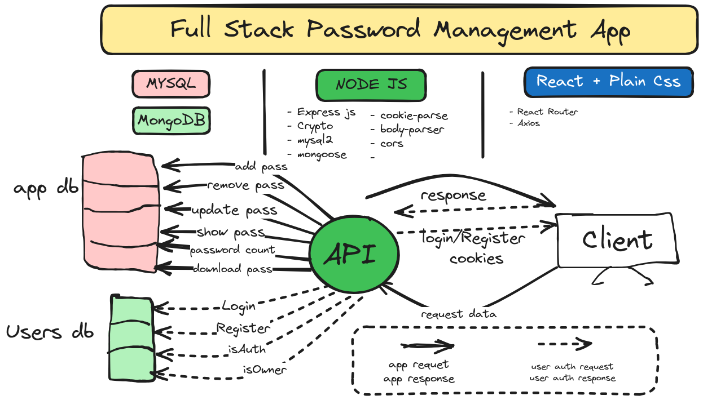

# Full Stack Password Management App
## Safe Pass
it's an app that manages your password, and store them in an sql db. I built it using `nodejs` and `express` in the backend and `React` for the front-end.
 
***[You can try](https://www.youtube.com/watch?v=q9V7kLXvP3E&list=PLpPqplz6dKxXfVVta2i-kZQR_61ZKZmgJ&index=3&ab_channel=PedroTech)*** 

## Features
- `Store` your passwords
- `See` all your passwords
- `Delete` your passwords
- `Update` your passwords
- See how many passwords you have

## App Architecture

